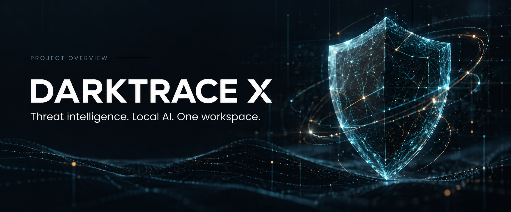
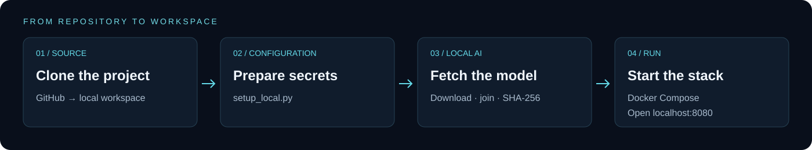
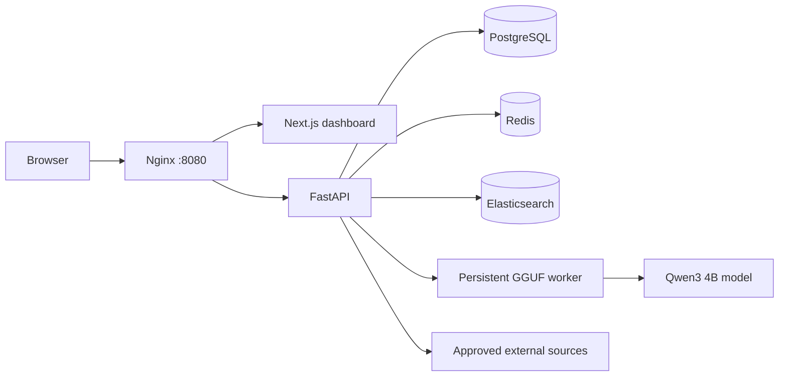

<p align="center"></p>

<p align="center">
<a href="https://github.com/hexalpha/DarkTrace-X/actions/workflows/ci.yml"></a>


</p>

<p align="center"><a href="#quick-start">Install & run</a> · <a href="docs/SHOWCASE.md">Screenshots</a> · <a href="docs/FEATURES.md">All features</a> · <a href="models/README.md">LLM model</a> · <a href="https://github.com/hexalpha/DarkTrace-X/releases/tag/v0.1.0-preview">Download release</a></p>

# DarkTrace X

A defensive threat-intelligence workspace that brings evidence, investigations and a local AI copilot into one interface. Built with Next.js, FastAPI, PostgreSQL, Redis and Elasticsearch, with a persistent Qwen GGUF worker for local inference.

Collect approved sources, inspect indicators and CVEs, follow alerts, and export intelligence reports. Workspaces begin empty; records and detections come from supplied evidence or explicitly connected sources.

> **Local preview.** Core services run locally. This release is not a production security certification. Cloud AI, SMTP delivery, licensed collection, GPU acceleration and Kubernetes require separate configuration or validation. See [release verification](docs/RELEASE_VERIFICATION.md).

## Dashboard


*Real application capture, September 23, 2026, in an isolated documentation workspace. Zero counts represent an empty workspace. The cover is an AI-generated illustration; application screenshots are real.*

## What you can do

| Area | Included capabilities |
| --- | --- |
| Intelligence operations | IOC records, exact correlation, threat hunting, actors, graph, asset registry and exposure evidence |
| Collection & processing | Approved-source registry; HTML/RSS/Atom/JSON/text parsing; manual and recurring crawls; documents, entities, events and crawl-job views |
| Detection & review | Keyword monitoring, evidence-linked alerts, statistical anomalies, trend priorities and source-reported geography |
| Local AI | Qwen3 4B GGUF, persistent worker, streaming copilot, private conversations, read-only tools and lexical project knowledge |
| Collaboration & export | Tenant workspaces, role-based access, audit records, PDF/DOCX/XLSX reports and configurable delivery jobs |
| Platform | REST, GraphQL, WebSockets, built-in MCP, bundled extensions, Docker Compose, migrations and Kubernetes manifests |

The [complete feature catalog](docs/FEATURES.md) explains every workspace area and its limits.

## Quick start

Use a **fresh clone** with Git, Python 3.12+ and Docker Engine/Desktop with Compose v2. A practical starting allocation is 16 GB RAM, 4 CPU cores and 20 GB free disk; this is planning guidance, not a measured minimum. The first local-LLM image build compiles native dependencies. No cloud API key is required.



```bash
git clone https://github.com/hexalpha/DarkTrace-X.git
cd DarkTrace-X
python scripts/setup_local.py
python scripts/model_assets.py download
docker compose --env-file .env.local up -d --build --wait
```

Use `py -3` on Windows or `python3` on macOS/Linux if needed. Open **[http://localhost:8080](http://localhost:8080)** → **Create a new workspace**. Choose a workspace ID, name, email and password of at least 12 characters. The first account becomes administrator; keep the workspace ID for future logins.

```bash
# Inspect services and API readiness
docker compose --env-file .env.local ps
curl http://localhost:8080/api/v1/health/ready

# Follow application logs
docker compose --env-file .env.local logs --tail=100 api local-llm

# Stop without deleting data, then resume
docker compose --env-file .env.local stop
docker compose --env-file .env.local up -d --wait
```

Full walkthrough: **[Installation guide](docs/INSTALLATION.md)**. Existing installations should preserve their environment files and volumes and follow [deployment operations](docs/DEPLOYMENT.md).

## Local LLM included in the release

The exact **2,497,277,408-byte Q4_K_M GGUF** is distributed as **two GitHub release assets**. The downloader checks and joins them automatically. Model weights stay out of Git history; source-code ZIP downloads do not include them.

| Asset | Purpose |
| --- | --- |
| `*.gguf.part001` + `*.gguf.part002` | Complete model bytes split below GitHub's per-asset limit |
| `model-manifest.json` | Sizes, download URLs and individual SHA-256 checksums |
| `SHA256SUMS.txt` | Part and complete-model checksums |
| `LICENSE-MODEL.txt` | Apache 2.0 license for the third-party model |

**[Download assets](https://github.com/hexalpha/DarkTrace-X/releases/tag/v0.1.0-preview)** · **[Model provenance & offline installation](models/README.md)**

## AI workspace


Streaming conversations, persisted history, source attribution and scoped read tools. Cloud providers are opt-in and require credentials. Project knowledge uses lexical retrieval, not vector embeddings.

## Architecture



The gateway binds to `127.0.0.1:8080`. The Compose core network is internal. The bundled worker supports CPU inference; CUDA offload is not verified.

## Repository map

```text
apps/api/       FastAPI, storage, migrations and backend tests
apps/web/       Next.js dashboard and copilot
apps/llm/       Persistent GGUF inference worker
docs/           Guides, features, verification and real screenshots
models/         Model manifest, attribution and license
infra/          Nginx, Elasticsearch helpers and Kubernetes
scripts/        Setup, model download, backup and recovery tools
.github/        Automated verification
```

## Documentation

| Guide | Purpose |
| --- | --- |
| [Installation](docs/INSTALLATION.md) | Fresh-machine setup, running and troubleshooting |
| [Screenshot tour](docs/SHOWCASE.md) | Authentication, dashboard, sources, reports and AI |
| [Feature catalog](docs/FEATURES.md) | Every workspace area and its behavior |
| [Release verification](docs/RELEASE_VERIFICATION.md) | Checks performed for this version |
| [Model guide](models/README.md) | Assets, checksums, reassembly and attribution |
| [API](docs/API.md) / [Database](docs/DATABASE.md) | Integration and persistence |
| [Deployment](docs/DEPLOYMENT.md) / [Security](docs/SECURITY.md) | Operational profiles and controls |
| [Copilot](docs/COPILOT.md) | Local inference and provider configuration |

Historical reports are dated snapshots and may describe earlier implementations. Use the current release verification and source for this version.

## Scope & licensing

No live licensed dark-web collection, SSO/MFA, immutable external audit retention or production penetration/load certification is claimed. Statistical scores are not calibrated attack probabilities. External delivery and provider adapters require independently configured services.

Application source retains its existing proprietary/internal-deployment status; publication does not grant a new open-source license. The third-party model is separately Apache-2.0 licensed; see [model notices](models/README.md). DarkTrace X is this repository's project name and does not imply affiliation with Darktrace plc or the model authors.
