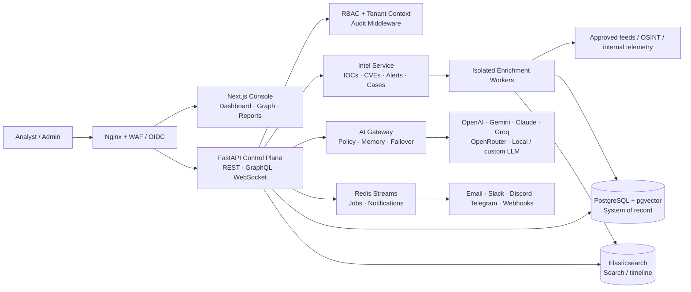
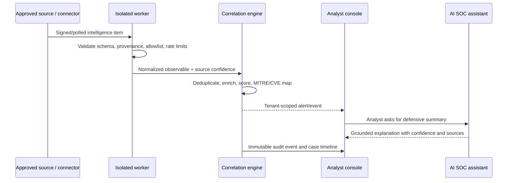

# DarkTrace X architecture

DarkTrace X separates the operator-facing **experience plane**, the tenant-aware **intelligence control plane**, and the isolated **data/enrichment plane**. This keeps incoming untrusted intelligence, provider credentials, and analyst sessions from sharing a trust boundary.

## Defensive data lifecycle

## Design decisions

- **Tenant boundary first:** every persisted intelligence object contains `tenant_id`; enforce it with PostgreSQL RLS in production and a request-scoped database role.
- **Provenance over volume:** raw source record, collection time, source terms, confidence, and transformation history are retained with each indicator.
- **AI is an assistive layer:** model calls are policy-scoped, sources are supplied as context, results are labeled as generated, and failover ends with an explicit unavailable status—never a fictional conclusion.
- **Async by default:** ingest, enrichment, export, and notifications run through queues so analyst interactions stay fast.
- **Zero trust between planes:** use workload identity, mTLS, egress allowlists, encrypted queues, and a dedicated secret manager in production.

