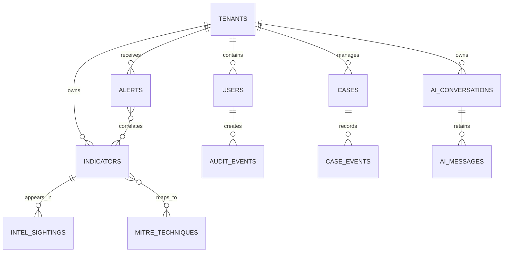

# Database schema

PostgreSQL is the source of truth. Elasticsearch provides derived search/timeline views; Redis carries ephemeral jobs, websocket fan-out, and rate-limit counters. Never treat a search index as the authoritative audit record.



```sql
CREATE EXTENSION IF NOT EXISTS pgcrypto;
CREATE EXTENSION IF NOT EXISTS vector;

CREATE TABLE tenants (
  id uuid PRIMARY KEY DEFAULT gen_random_uuid(),
  slug text UNIQUE NOT NULL,
  name text NOT NULL,
  plan text NOT NULL DEFAULT 'enterprise',
  created_at timestamptz NOT NULL DEFAULT now()
);

CREATE TABLE users (
  id uuid PRIMARY KEY DEFAULT gen_random_uuid(),
  tenant_id uuid NOT NULL REFERENCES tenants(id),
  email citext NOT NULL,
  display_name text NOT NULL,
  role text NOT NULL CHECK (role IN ('viewer','analyst','lead','admin')),
  identity_provider text NOT NULL DEFAULT 'oidc',
  created_at timestamptz NOT NULL DEFAULT now(),
  UNIQUE (tenant_id, email)
);

CREATE TABLE indicators (
  id uuid PRIMARY KEY DEFAULT gen_random_uuid(),
  tenant_id uuid NOT NULL REFERENCES tenants(id),
  type text NOT NULL CHECK (type IN ('ip','domain','url','hash','email','file')),
  value text NOT NULL,
  normalized_value text NOT NULL,
  confidence smallint NOT NULL CHECK (confidence BETWEEN 0 AND 100),
  risk_score smallint NOT NULL CHECK (risk_score BETWEEN 0 AND 100),
  status text NOT NULL DEFAULT 'active',
  first_seen timestamptz,
  last_seen timestamptz,
  tags text[] NOT NULL DEFAULT '{}',
  provenance jsonb NOT NULL DEFAULT '[]'::jsonb,
  created_by uuid REFERENCES users(id),
  created_at timestamptz NOT NULL DEFAULT now(),
  UNIQUE (tenant_id, type, normalized_value)
);
CREATE INDEX indicators_tenant_risk_idx ON indicators (tenant_id, risk_score DESC);

CREATE TABLE intel_sightings (
  id uuid PRIMARY KEY DEFAULT gen_random_uuid(),
  tenant_id uuid NOT NULL REFERENCES tenants(id),
  indicator_id uuid REFERENCES indicators(id),
  source_id text NOT NULL,
  source_tier smallint NOT NULL CHECK (source_tier BETWEEN 1 AND 5),
  observed_at timestamptz NOT NULL,
  raw_ref text,
  attributes jsonb NOT NULL DEFAULT '{}'::jsonb,
  retention_until timestamptz
);

CREATE TABLE alerts (
  id uuid PRIMARY KEY DEFAULT gen_random_uuid(),
  tenant_id uuid NOT NULL REFERENCES tenants(id),
  title text NOT NULL,
  severity text NOT NULL CHECK (severity IN ('critical','high','medium','low','info')),
  status text NOT NULL DEFAULT 'open',
  score smallint NOT NULL CHECK (score BETWEEN 0 AND 100),
  evidence jsonb NOT NULL DEFAULT '[]'::jsonb,
  mitre_techniques text[] NOT NULL DEFAULT '{}',
  assigned_to uuid REFERENCES users(id),
  created_at timestamptz NOT NULL DEFAULT now(),
  updated_at timestamptz NOT NULL DEFAULT now()
);
CREATE INDEX alerts_tenant_status_idx ON alerts (tenant_id, status, created_at DESC);

CREATE TABLE ai_conversations (
  id uuid PRIMARY KEY DEFAULT gen_random_uuid(),
  tenant_id uuid NOT NULL REFERENCES tenants(id),
  user_id uuid NOT NULL REFERENCES users(id),
  title text,
  classification text NOT NULL DEFAULT 'internal',
  created_at timestamptz NOT NULL DEFAULT now()
);
CREATE TABLE ai_messages (
  id uuid PRIMARY KEY DEFAULT gen_random_uuid(),
  conversation_id uuid NOT NULL REFERENCES ai_conversations(id) ON DELETE CASCADE,
  role text NOT NULL CHECK (role IN ('system','user','assistant','tool')),
  provider text,
  model text,
  content text NOT NULL,
  source_refs jsonb NOT NULL DEFAULT '[]'::jsonb,
  created_at timestamptz NOT NULL DEFAULT now()
);
CREATE TABLE audit_events (
  id uuid PRIMARY KEY DEFAULT gen_random_uuid(),
  tenant_id uuid NOT NULL REFERENCES tenants(id),
  actor_id uuid REFERENCES users(id),
  action text NOT NULL,
  resource_type text NOT NULL,
  resource_id text,
  request_id uuid NOT NULL,
  ip_hash text,
  metadata jsonb NOT NULL DEFAULT '{}'::jsonb,
  occurred_at timestamptz NOT NULL DEFAULT now()
);
```

Enable RLS for each tenant-owned table and set a transaction-local tenant id in the API layer. In production, partition high-volume `intel_sightings`, `audit_events`, and timeline tables monthly; encrypt sensitive fields using envelope encryption and keep the KMS key external to PostgreSQL.

