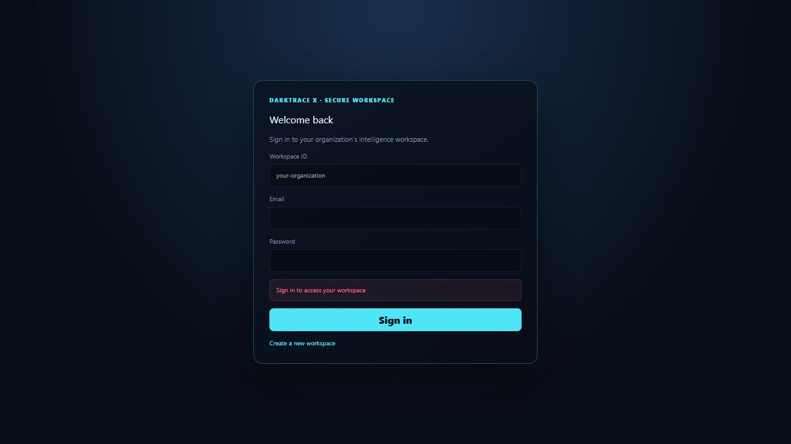
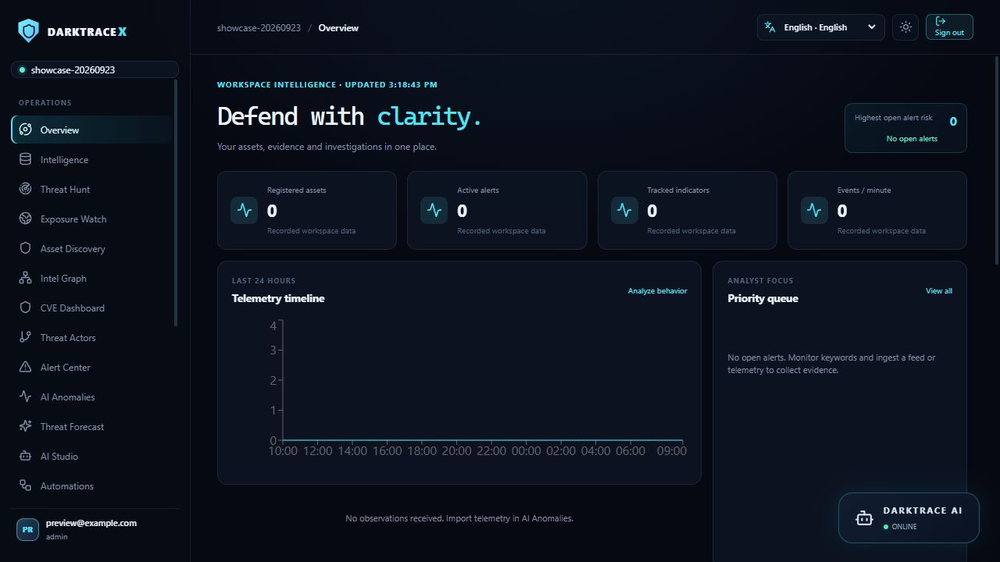
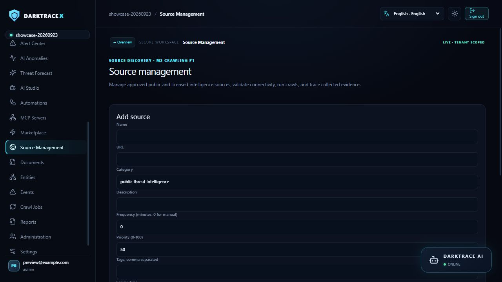
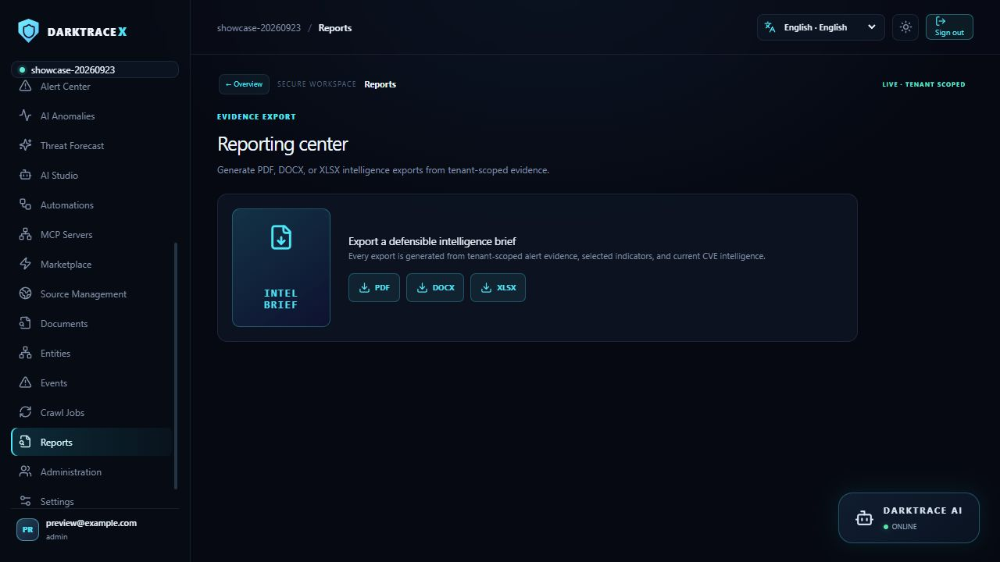
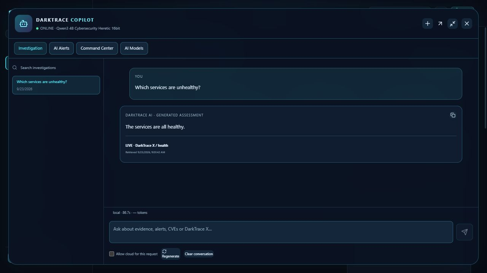
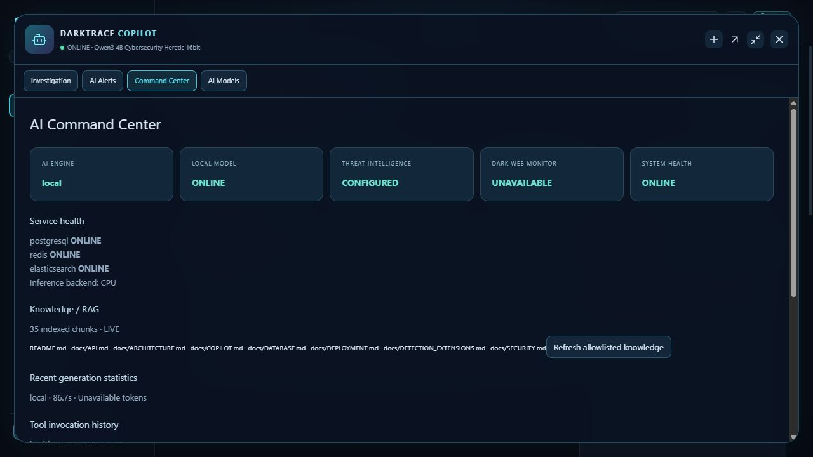

# Screenshot tour

Captured from the running app on September 23, 2026, using a separate documentation workspace (`showcase-20260923`, `preview@example.com`). Empty panels reflect its real state. No simulated alerts or performance numbers were inserted.

## Authentication

Explicit workspace login with separate first-administrator registration.

## Operations overview

Counts, telemetry and analyst priority. New workspaces stay empty until evidence arrives.

## Source management

Parser choice, source types, crawl policies, tags and priorities.

## Reports

PDF, DOCX and XLSX exports of recorded evidence.

## Local AI

A real conversation with the persistent local model.

## Runtime

Application-reported dependency/model status at capture time. Local health is not production certification.

## Image provenance

`cover.png` is a built-in ImageGen illustration. Other PNGs here are direct browser captures; `quickstart.svg` is a source-authored diagram. [Cover prompt](IMAGE_PROMPT.md).
